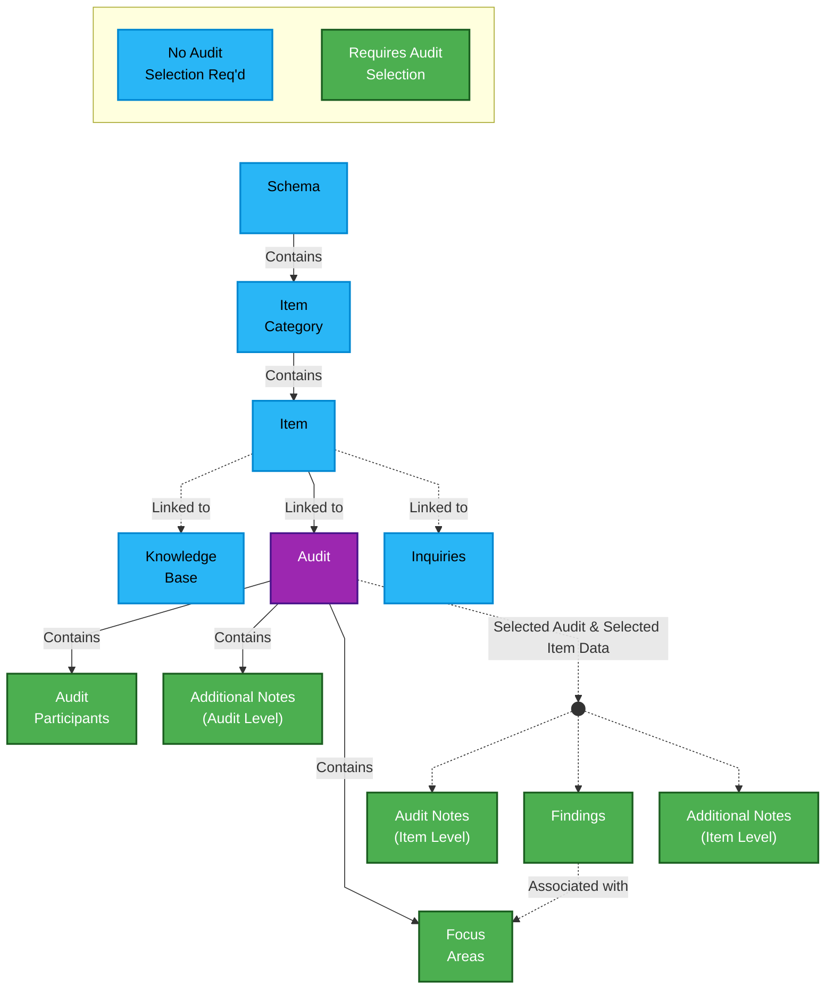

```mermaid
%%{init: {"flowchart": {"curve": "linear", "nodeSpacing": 30, "rankSpacing": 30, "padding": 15}}}%%
graph TD
    subgraph Legend [" "]
        direction LR
        L1["No Audit<br>Selection Req'd"] ~~~ L2["Requires Audit<br>Selection"]
    end

    subgraph Framework [" "]
        direction LR
        S["Schema<br>&nbsp;"] -->|Contains| IC["Item<br>Category"] -->|Contains| I["Item<br>&nbsp;"]
    end

    Legend ~~~ Framework

    I -.->|Linked to| KB["Knowledge<br>Base"]
    I -->|Linked to| A["Audit<br>&nbsp;"]
    I -.->|Linked to| INQ["Inquiries<br>&nbsp;"]

    A -->|Contains| AP["Audit<br>Participants"]
    A -->|Contains| AAN["Additional Notes<br>(Audit Level)"]
    A -->|Contains| FA["Focus<br>Areas"]
    A -.->|"Selected Audit & Selected Item Data"| J((" "))

    J -.-> AN["Audit Notes<br>(Item Level)"]
    J -.-> F["Findings<br>&nbsp;"]
    J -.-> ADN["Additional Notes<br>(Item Level)"]

    F -.->|Associated with| FA

    %% Styling
    classDef navy fill:#29B6F6,stroke:#0288D1,stroke-width:2px,color:#000000;
    classDef audit fill:#9C27B0,stroke:#4A148C,stroke-width:2px,color:#ffffff;
    classDef notes fill:#4CAF50,stroke:#1B5E20,stroke-width:2px,color:#ffffff;
    classDef junction fill:#333,stroke:#333,stroke-width:1px,color:#fff;

    class S,IC,I,KB,INQ,L1 navy;
    class A audit;
    class AN,ADN,F,FA,AAN,AP,L2 notes;
    class J junction;

    style Framework fill:none,stroke:none
```