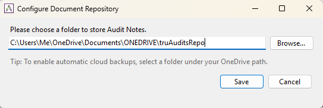

## Table of Contents

1. [Document Repository](#document-repository)

## Document Repository

The Document Repository is your designated local folder where all audit documents are stored, allowing the Auditor to work efficiently in offline mode. 

Please note that it is the Auditor's sole responsibility to maintain backups of this folder to prevent data loss. A highly recommended practice to ensure your data is secure is to store this folder within Microsoft OneDrive (or a similar cloud-syncing service) and verify that it is actively synchronizing with your online account.

### Configuration Steps

To set up your Document Repository, please complete the following steps:

1. Navigate to the main menu and click on **Configure**.
2. Select **Configure Document Repository** from the available options.
3. Browse your file system to define the local directory where your audit documents will be saved. *(Tip: We highly encourage choosing a folder integrated with **OneDrive** to guarantee continuous synchronization and secure backups).*

   

      
   

---

    
    
         &copy; 2026 truAudits by truRigel Team | Secured via Microsoft Store
    

