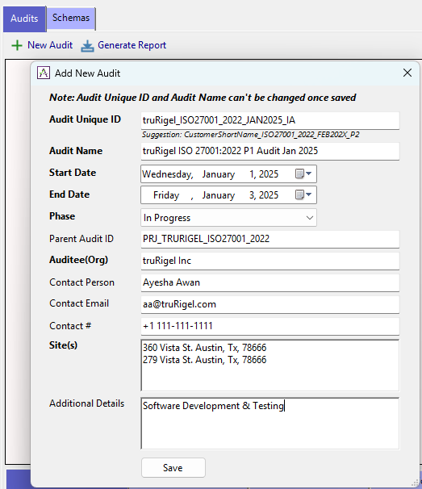
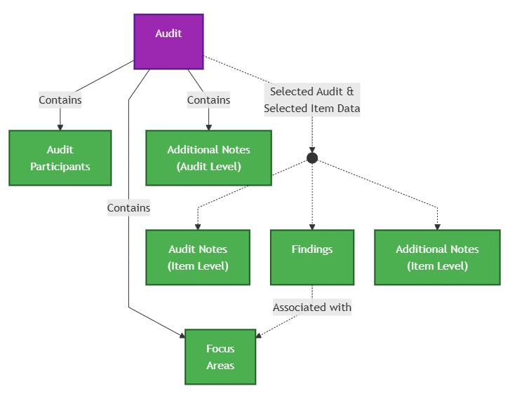
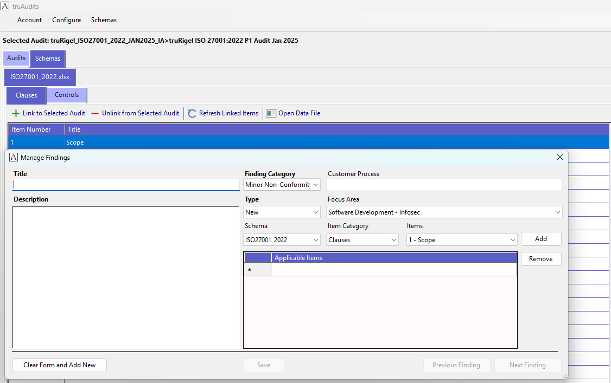

# Audits

Now that you have set up your **Schemas**, **Knowledge Base**, and **Inquiries**, the foundation is in place. It is time to create an **Audit** — the workspace where all assessment activity is planned, recorded, and tracked.

---

## Managing Schema Visibility

Before creating an audit, you may want to control which schemas are visible in the Audits view. If you work with multiple schemas, this helps you focus on only the ones relevant to the current engagement.

To show or hide schemas:
1. Navigate to **Menu → Manage Schemas**.
2. Select the **Available Schemas** tab.
3. Click the **Visible** checkbox next to each schema you want to include or exclude.

Only schemas marked as visible will appear when creating or working with audits.

---

## Creating an Audit

To create a new audit:
1. Select the **Audits** tab in the main view.
2. Click the **New Audit** button.

Provide the required details such as the audit name and any initial configuration. Once created, the audit becomes your active workspace for the assessment.

---

## Audit-Related Objects

An audit is more than a single record — it contains several associated objects that help you organize and capture your assessment data effectively.

### Audit Participants
Record the individuals involved in the audit. This typically includes auditors, auditees, and observers. Maintaining a clear participant list ensures accountability and traceability throughout the engagement.

### Focus Areas
Define the key topics or priorities the audit should concentrate on. Focus Areas allow you to direct attention to specific risk areas, control domains, or themes that matter most for the assessment.

### Additional Notes (Audit Level)
Capture general observations, context, or background information that applies to the entire audit. These notes are not tied to any specific item — they serve as a high-level reference for the audit team.

---

## Item-Level Data

When you select both an **Audit** and a specific **Item** from the schema, additional objects become available. These are shown as dashed lines in the diagram above.

### Audit Notes (Item Level)
Document observations, evidence, and comments for each schema item being assessed. This is where the core audit work is recorded during fieldwork.

### Findings
Record formal outcomes or issues identified during the assessment. Each finding can be linked to a **Focus Area**, providing clear traceability between what was found and the priority area it relates to.

> **Tip:** Make sure your **Focus Areas** are entered before logging findings so they can be associated with each finding.

**How to Create a Finding:**

You can create findings in two ways:

1. **Direct Method** — Navigate to the **Audits** tab → select your audit → open the **Findings** tab → click the **New Findings** button.

2. **Recommended Method** — Select an Audit row under the **Audits** tab, then switch to the **Schema** tab, select the item you want to assess, and click **"Link to selected Audit"**. Double-click the linked item and the Findings screen will open with the schema item pre-selected.

You can associate multiple schema items against a single finding, making it easy to capture issues that span across several requirements or controls.

### Additional Notes (Item Level)
Add any supplementary detail beyond the primary audit notes for a given item. Use these for supporting context, follow-up reminders, or reference material specific to that item.
