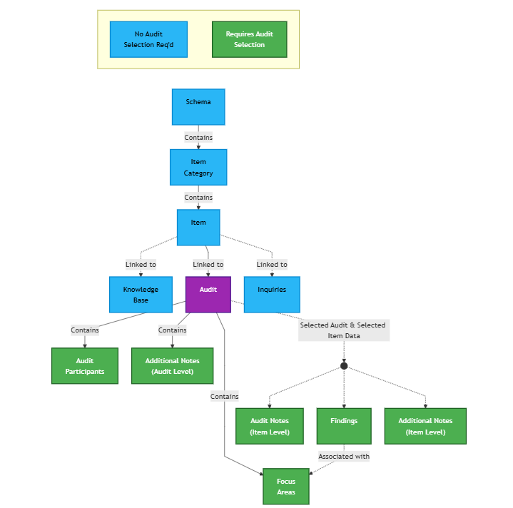

## Welcome to truAudits Help Center

Welcome to the official documentation and support center for truAudits.

Please select a topic from the left sidebar to continue reading.

### How truAudits Works

truAudits follows a simple top-down structure. Everything starts with a **Schema** — the standard or framework you are auditing against. Here is how the pieces fit together:

---

### Step 1 — Define Your Framework

Start by creating a **Schema**. A Schema represents the standard or framework you plan to audit — for example, ISO 27001:2022 or SOC 2. Think of it as the master template that holds everything together.

Inside each Schema, you organize requirements into **Item Categories** (such as "Clauses" or "Controls"). Each category then contains individual **Items** — the specific requirements or checkpoints your auditors will assess.

> **Schema → Item Categories → Items**

### Step 2 — Build Supporting Content (No Audit Selection Needed)

Before starting any audit, you can enrich your Items with two types of reference data:

- **Knowledge Base** — Attach background materials, policy references, or consolidated documentation to any Item. This serves as a ready-made reference library for your audit team.
- **Inquiries** — Define a structured set of questions or evaluation criteria for each Item. These act as a checklist auditors can follow during assessments.

Both Knowledge Base and Inquiries are managed in Excel format and can be set up entirely without creating an audit.

### Step 3 — Create and Run an Audit

When you are ready to begin an assessment, create an **Audit** and link it to the Items from your Schema. The Audit is the workspace where all assessment activity is captured.

At the audit level, you can manage:

- **Audit Participants** — Record who is involved in the audit (auditors, auditees, observers).
- **Focus Areas** — Define key topics or priorities the audit should concentrate on.
- **Additional Notes (Audit Level)** — Capture general observations or context that applies to the entire audit.

### Step 4 — Record Item-Level Findings

Once an audit is active and you select a specific Item, the following become available:

- **Audit Notes (Item Level)** — Document observations, evidence, and comments for each Item being assessed.
- **Findings** — Record formal outcomes or issues identified during the assessment. Findings can be linked to Focus Areas for traceability.
- **Additional Notes (Item Level)** — Add any supplementary detail beyond the primary audit notes for a given Item.

> These require both an **Audit** and an **Item** to be selected — shown as dashed lines in the diagram above.

---

### Getting Started
* [Configure your Document Repository](#document-repository)
* [Set up your Schemas](#schemas)
* [Build your Knowledge Base](#knowledge-base)
* [Define Inquiries](#inquiries)